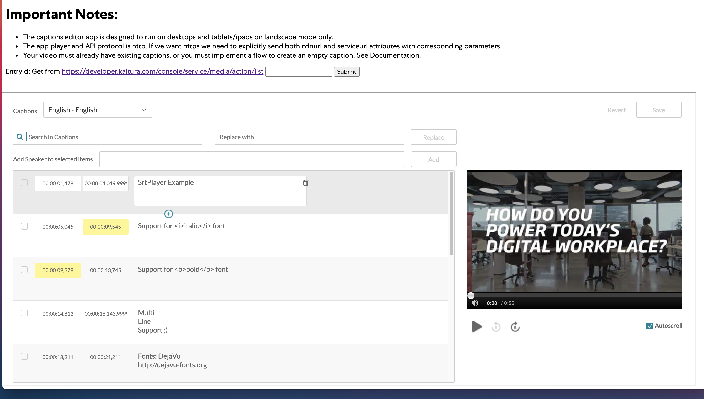

# Kaltura Caption Editor Embed
A guide to embed the Kaltura Caption Editor in your web application. Kaltura has a rich [captioning Experience](https://knowledge.kaltura.com/help/using-subtitles-and-captions) that is available in the [KMC](https://kmc.kaltura.com/index.php/kmcng/login)

However, you also are able to embed the caption editor by itself as shown below:

To use the demo, supply a media entry id from your account that can be acquired via:https://developer.kaltura.com/console/service/media/action/list

The caption editor will only work with media entries that already have existing captions. If you wanted to create an experience where captions are able to be added for the first time, you could create a blank [CaptionAsset](https://developer.kaltura.com/console/service/captionAsset) by following this workflow:

https://developer.kaltura.com/workflows/Enrich_and_Organize_Metadata/Captions

# How to Run

#### PHP

Fill out all the variables as specified and run the example.

#### Node.JS

1. Install https://nodejs.org/en/
2. Copy env.template to .env and fill in your information
3. run npm install
4. npm run dev for developement
5. npm start for production

# How you can help (guidelines for contributors) 
Thank you for helping Kaltura grow! If you'd like to contribute please follow these steps:
* Use the repository issues tracker to report bugs or feature requests
* Read [Contributing Code to the Kaltura Platform](https://github.com/kaltura/platform-install-packages/blob/master/doc/Contributing-to-the-Kaltura-Platform.md)
* Sign the [Kaltura Contributor License Agreement](https://agentcontribs.kaltura.org/)

# Where to get help
* Join the [Kaltura Community Forums](https://forum.kaltura.org/) to ask questions or start discussions
* Read the [Code of conduct](https://forum.kaltura.org/faq) and be patient and respectful

# Get in touch
You can learn more about Kaltura and start a free trial at: http://corp.kaltura.com    
Contact us via Twitter [@Kaltura](https://twitter.com/Kaltura) or email: community@kaltura.com  
We'd love to hear from you!

# License and Copyright Information
All code in this project is released under the [AGPLv3 license](http://www.gnu.org/licenses/agpl-3.0.html) unless a different license for a particular library is specified in the applicable library path.   

Copyright © Kaltura Inc. All rights reserved.   
Authors and contributors: See [GitHub contributors list](https://github.com/kaltura/YOURREPONAME/graphs/contributors).  

### Open Source Libraries Used
